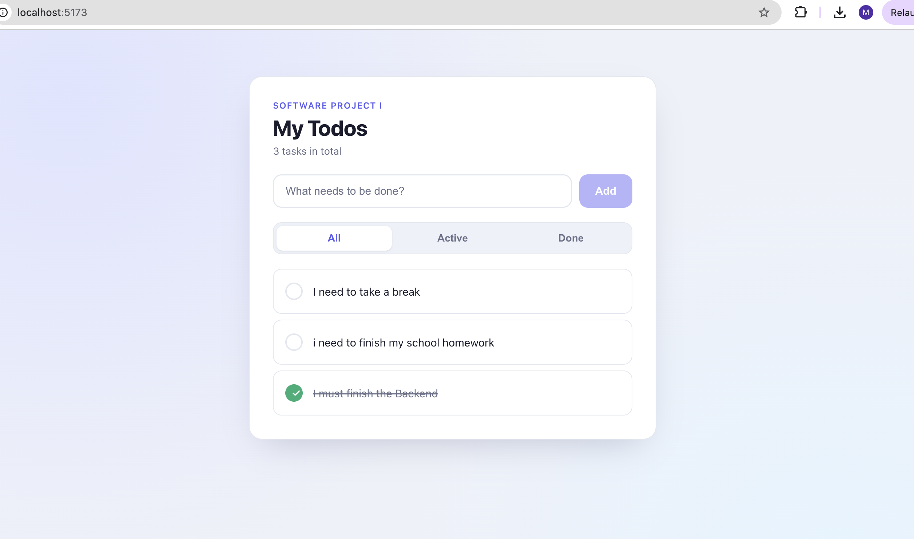
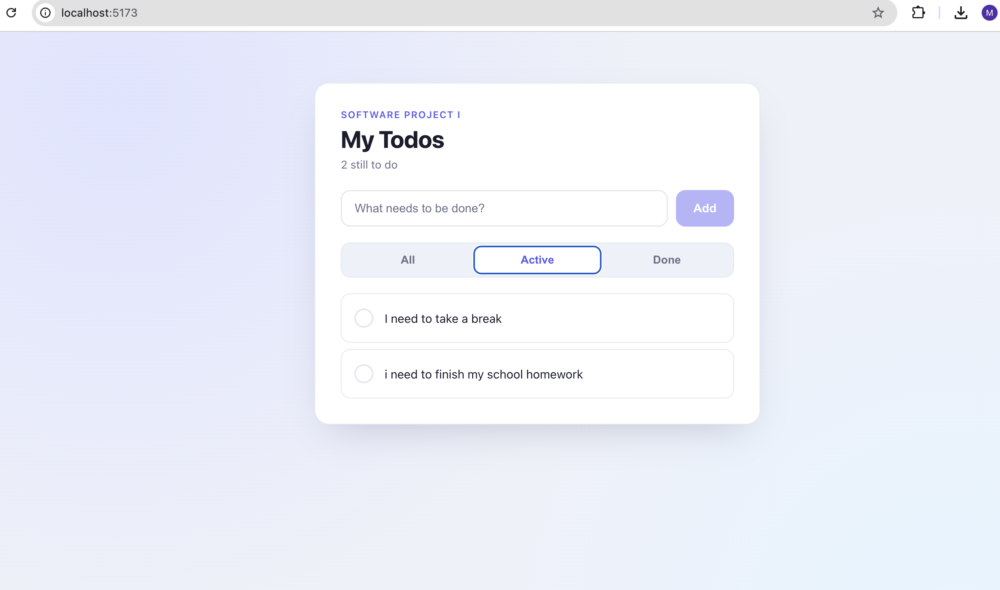
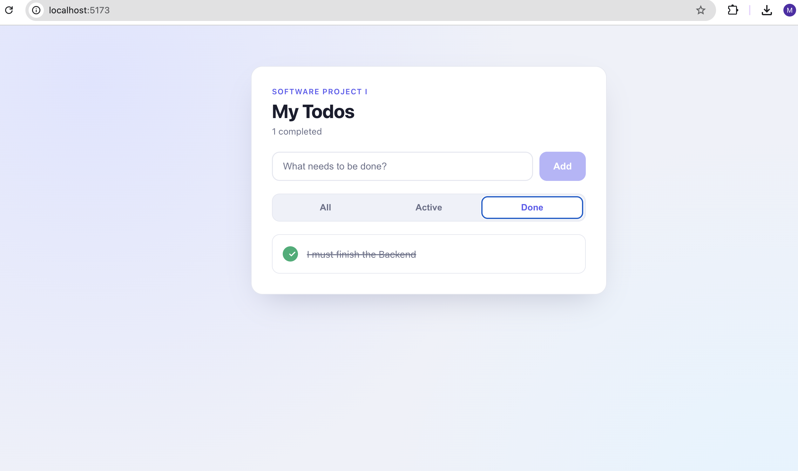

# Practice Assignment 1 – Filter & Search Todos

A full-stack todo app (Node.js, Express, MongoDB, React) that supports server-side filtering by completion status.

| Request | Returns |
|---|---|
| `GET /api/todos` | All todos (unchanged behavior) |
| `GET /api/todos?done=true` | Completed todos only |
| `GET /api/todos?done=false` | Pending todos only |

## What Changed

- **Backend (`todoController.js`):** `getTodos` reads `done` from `req.query` and builds a filter object only when the parameter is present, then calls `Todo.find(filter)`. With no parameter the filter stays `{}`, so all todos are returned.
- **API (`api/todos.js`):** `fetchTodos(done)` sends the filter as a query string using Axios `params`.
- **App (`App.jsx`):** a `filter` state (`all` / `active` / `done`) re-runs `fetchTodos` through the `useEffect` dependency array whenever it changes.
- **UI:** All / Active / Done tabs, plus a live task count.

## Screenshots

**All** – no query parameter, so all 3 todos are returned:



**Active** – `?done=false`, so only the 2 pending todos are returned:



**Done** – `?done=true`, so only the 1 completed todo is returned:



## Server-Side vs Client-Side Filtering

Server-side filtering (implemented here) sends only the needed data and scales to large datasets, but each tab switch costs a network request. Client-side filtering makes tab switches instant, but downloads every todo up front, so it only suits small lists.

## Run Locally

```bash
# backend (needs backend/.env with MONGO_URI=...)
cd backend && npm install && npm start

# frontend
cd frontend && npm install && npm run dev
```
